  

Hi, I'm **Suyog**. I build document tools that run in the browser: PDF tools and AI features at **[FynePDF](https://fynepdf.com)**, and **[IntelliDoc](https://suyog-gautam.github.io/intellidoc/)**, my own editor for scanned documents.

Most days that's React, Next.js and TypeScript up front, with Node.js and Postgres behind it. The problems I keep coming back to are the ones where the browser has to do real work: big PDFs, OCR, canvas rendering, WebAssembly.

## What I'm working on

**FynePDF** · *Full-stack engineer, Sep 2025 – now* 
Browser-based PDF tools and AI document agents. I built things like AI redaction you can describe in plain words, a virtualized viewer that stopped large PDFs from crashing the tab, and plan limits and AI allowances on the backend.

**IntelliDoc** · *[Live](https://suyog-gautam.github.io/intellidoc/) · [Code](https://github.com/suyog-gautam/intellidoc)* 
Change a date, a name or a number in a scanned PDF or photo. It finds the text, rebuilds the paper underneath and redraws the new text to match the scan. Nothing leaves your device.

How it edits a scan:

1. **Read.** OCR finds every line of text, in 40 languages.
2. **Match.** Candidate fonts are fitted against the real pixels: size, weight, slant, blur.
3. **Rebuild.** The old text is removed and the paper underneath is filled back in, grain and all.
4. **Render.** The new text is drawn with the fitted style and rotated back into place.

[Try it with any scan →](https://suyog-gautam.github.io/intellidoc/)

## Other things I've built

| Project | What it does | Built with |
|---|---|---|
| [Quick Care](https://github.com/suyog-gautam/QuickCare) | Hospital appointments: booking, doctor schedules, admin panel, eSewa payments | MERN · Tailwind · shadcn/ui |
| [Job Nest](https://github.com/suyog-gautam/JobNest) | Mobile job portal: post, search, save, apply with a resume | React Native · Firebase |
| [Expense Tracker](https://github.com/suyog-gautam/Expense-Tracker-tool) · [live](https://suyog-gautam.github.io/Expense-Tracker-tool/) | Income, expenses and a running balance that survives a reload | React · localStorage |
| [Chat App](https://github.com/suyog-gautam/Chat-App) | Real-time chat | React · Firebase · NextUI |
| [Keep Notes](https://github.com/suyog-gautam/Keep-Notes) | Notes with auth and search | MERN |

## Tools I reach for

               -111110?style=flat-square&logo=go&logoColor=DCF64A)  

## GitHub, in numbers

  

  
  

## Say hello

     [-111110?style=for-the-badge&logo=readthedocs&logoColor=DCF64A)](https://gautamsuyog.com.np/Suyog-Gautam-Resume.pdf)

If you've read this far: the fastest way to reach me is email.
